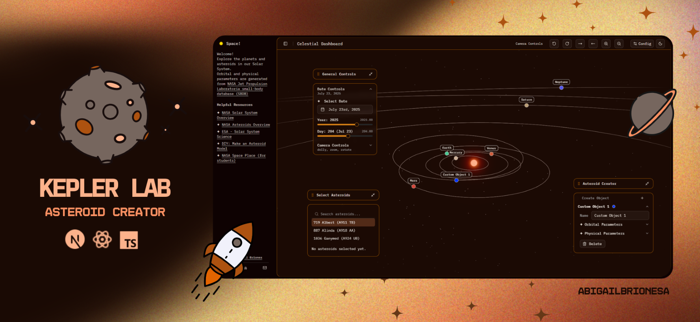

<samp>

# Kepler Lab

Kepler Lab is a 3D asteroid-orbit laboratory for exploring more than 40,000 NASA JPL asteroid records in a real-time browser scene. It combines orbital math, Three.js rendering, search, custom objects, and timeline controls into an interactive astronomy workspace.

Built with <strong>Next.js, React Three Fiber, Three.js, NASA JPL-style asteroid data, and typed scene state</strong>.

## Highlights

<ul>
  <li>Renders planets, asteroid trajectories, stars, lighting, and camera controls in a full 3D scene.</li>
  <li>Uses local asteroid and planet datasets for fast search and inspection without a backend requirement.</li>
  <li>Includes controls for dates, asteroid queries, selected objects, pivots, and custom object creation.</li>
  <li>Separates scene state into typed React contexts for camera, selected asteroid, dates, and object refs.</li>
</ul>

## Tech Stack

<table>
  <tr><th>Layer</th><th>Tools</th></tr>
  <tr><td>Core stack</td><td>TypeScript, Next.js 15, React 19, Three.js</td></tr>
  <tr><td>Supporting tools</td><td>React Three Fiber, React Three Drei, Chart.js, Tailwind CSS</td></tr>
</table>

## Quick Start

<pre><code>npm install
npm run dev
npm run build</code></pre>

## Project Structure

<pre>app/ - Next.js pages, layout, and global styles
components/3d/ - Solar system, asteroids, planets, effects, and objects
components/panel/ - Sidebar controls, queries, tutorial, and scene panels
context/scene/ - View and scene state providers
lib/data/ and public/data/ - Planet and asteroid JSON data
public/models/ and public/textures/ - 3D and texture assets</pre>

## Validation

Run <code>npm run build</code>. The package also defines <code>npm run lint</code>, though the configured Next.js lint command may need updating for the current Next version.

## Scope Notes

The app uses local JSON data and client rendering; it is a visualization tool, not an authoritative ephemeris service.

## Roadmap

<ul>
  <li>Add benchmark notes for asteroid count, frame rate, and device class.</li>
  <li>Document the data export process from NASA/JPL sources.</li>
  <li>Add saved scenes or shareable view URLs.</li>
</ul>

## License

No license file is currently included.

## Built By

Built by <strong>Abigail Briones Aranda</strong> as part of a growing AI/software engineering portfolio focused on readable systems, thoughtful interfaces, and reproducible project documentation.

</samp>
